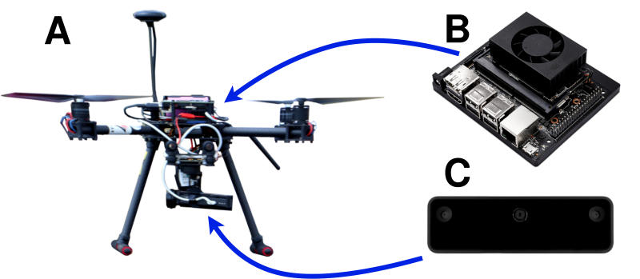

# VITAL

[](https://github.com/PUTvision/VITAL/graphs/contributors)
[](https://makeapullrequest.com)
[](https://github.com/PUTvision/VITAL/stargazers)
[](https://github.com/PUTvision/VITAL/network/members)

## Deep Learning Based Vision Pipeline for Near Real-Time Autonomous UAV Landing Support With Added Robustness



## What is VITAL?

This repository includes an image processing pipeline for accurate landing pad detection and relative pose estimation of the UAV w.r.t. the landing pad, while also providing a human detection in local environment.

## Highlights

-   **Real-time** - the system is able to process the image in real time.

-   **Modular** - the system is modular and can be easily extended with new functionalities. It is easly adaptable to different cameras and landing targets.

-   **Autonomous landing** - the system is able to provide information about the target's position continuously, which allows to build a pipeline for landing on moving targets.

-   **Safety** - the system is able to detect the presence of a human near the landing site.

-   **Precision landing** - the system is able to detect landing target with a precision of 1 cm.


## Prerequisites

- ROS Melodic/Noetic. Pipeline was tested on Ubuntu 18.04 (NVIDIA Jetson Xavier NX) with ROS Melodic and Ubuntu 20.04 (PC) with ROS Noetic.
- MAVROS. MAVROS is a ROS-Node that allows to communicate with the autopilot. It is used to get the altitude of the UAV.
- `requirements.txt` - contains all the required python packages. To install them run `python3 -m pip install -r requirements.txt` in the virtual environment.

## Installation 

* `cd catkin_ws/src`

* `git clone https://github.com/PUTvision/VITAL.git`

* `cd ../` 

* `catkin build`

## Config documentation

All configuration parameters from `config.yaml` are described in [config docs](./docs/CONFIG.md).

## Usage

* `source devel/setup.bash`

* `roslaunch visual_landing_provider visual_infer.launch`


## Thing for developers

If you:
- want to understand how the system works
- want to build your own models
- want to adapt the pipeline to your needs

then you should read the [developer docs](./docs/DEV.md).

## Citation

If you use this code for your research, please cite our paper:

```
(SOON)
```
