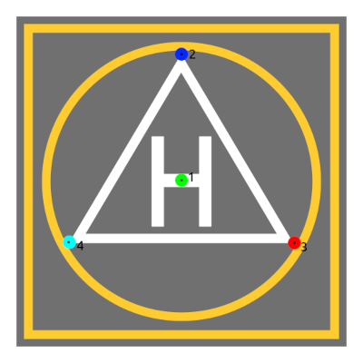

# For developers

[Back to README](../README.md)


## Prerequisites

You need a real landing target, for example permanent one or printed like ours:



Then you need to define real world model of the landing target in meters. For example, if you use our landing target, you can use the following model:

```yaml
target_real_model: [
    [0.0, 0.0, 0.0], #middle
    [0.0, -0.227, 0.0], #up
    [0.204, 0.116, 0.0], #right
    [-0.204, 0.116, 0.0], #left      
  ]
```

## Camera calibration

Next step is to calibrate your camera. You can use [this](https://docs.opencv.org/master/dc/dbb/tutorial_py_calibration.html) tutorial to calibrate your camera. You need to save camera matrix and distortion coefficients to use them in the configuration file.

## Density estimator model

Now, the hardest part is to train the density estimator model. You need to collect a dataset of images with the landing target and without it. In the dataset, you need to have images with the landing target in different positions and orientations; with people and without. Your task is to label them. You can use tools like [roboflow](https://app.roboflow.com/), [labelbox](https://labelbox.com/) or [cvat](https://cvat.org/).

Then you need to train the density estimator model with two classes: landing target and people. We recommend using [pytorch lightning](https://github.com/Lightning-AI/lightning) and [segmentation_models.pytorch](https://github.com/qubvel/segmentation_models.pytorch).

## Keypoints detector model

If your density estimator model is trained, you can train the keypoints detector model. You can use it to extract the region of interest and then annotate it with keypoints. Note that you need at least 4 keypoints to estimate the pose of the landing target.

**Code for training the density estimator and keypoints detector models will be available soon.**

[Back to README](../README.md)
